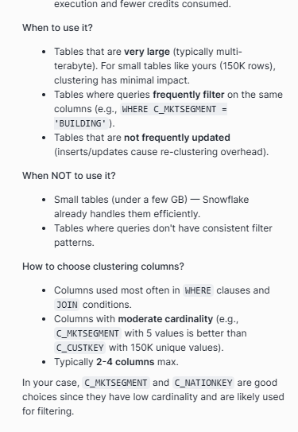
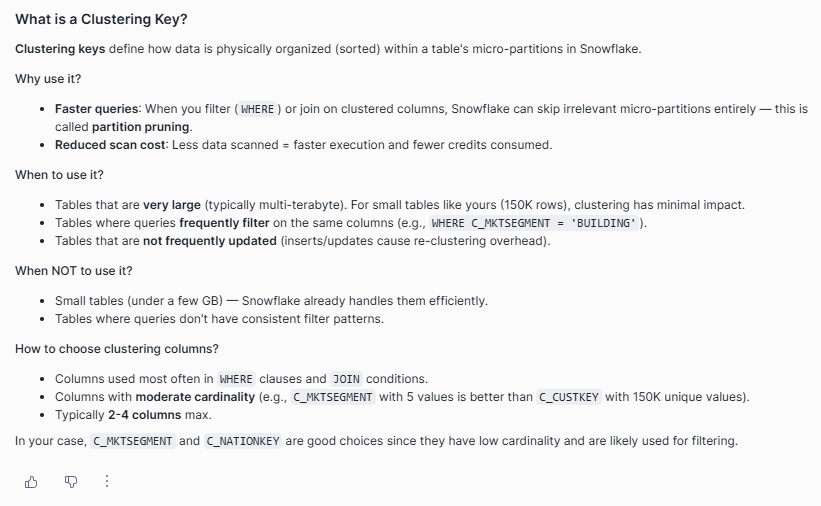
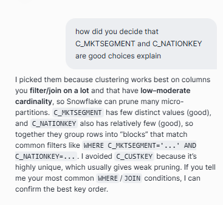

# Select database 

USE DATABASE "USER$MUHAMMAD9999";  

# Show all available SCHEMAS

SHOW SCHEMAS IN DATABASE "USER$MUHAMMAD9999";
SHOW SCHEMAS IN DATABASE "USER$MUHAMMAD9999";

# Select schema
USE SCHEMA PUBLIC;

# Create a Schema
CREATE SCHEMA IF NOT EXISTS PUBLIC;

# Default schema

USE SCHEMA PUBLIC; 

CREATE DATABASE IF NOT EXISTS MY_DATABASE;
USE DATABASE MY_DATABASE;

CREATE TABLE CUSTOMER_S21 AS
SELECT * 
FROM SNOWFLAKE_SAMPLE_DATA.TPCH_SF1.CUSTOMER;

***
 CREATE TABLE MY_DATABASE.PUBLIC.CUSTOMER_S21 (
    C_CUSTKEY NUMBER,
    C_NAME VARCHAR,
    C_ADDRESS VARCHAR,
    C_NATIONKEY NUMBER,
    C_PHONE VARCHAR,
    C_ACCTBAL NUMBER,

INSERT INTO MY_DATABASE.PUBLIC.CUSTOMER_S21
SELECT * FROM SNOWFLAKE_SAMPLE_DATA.TPCH_SF1.CUSTOMER;
 ***

 # Let me first add the clustering key to your existing table, then explain the concept.
# Let me first check the columns of your table, then add the clustering key:

# Shows the table definition: columns, data types, nullability, etc.
DESCRIBE TABLE MY_DATABASE.PUBLIC.CUSTOMER_S21
# Changes the table’s clustering key so Snowflake organizes data by those columns.

ALTER TABLE MY_DATABASE.PUBLIC.CUSTOMER_S21 CLUSTER BY (C_MKTSEGMENT, C_NATIONKEY);

# What is a Clustering Key?

Clustering keys define how data is physically organized (sorted) within a table's micro-partitions in Snowflake.

## Why use a clustering key?

- **Faster queries**: When you filter (WHERE) or join on clustered columns, Snowflake can skip irrelevant micro-partitions entirely — this is called partition pruning

- **Reduced scan cost**: Less data scanned = faster execution and fewer credits consumed.

## When to use a clustering key

- Very large tables (typically multi-terabyte).
- Tables where queries often filter on the same columns.
- Tables that are not frequently updated, because inserts or updates can increase re-clustering overhead.

> For smaller tables like yours (~150K rows), clustering typically has minimal benefit.

## When not to use it

- Small tables (under a few GB) — Snowflake already handles them efficiently.
- Tables without consistent filter patterns.

## How to choose clustering columns

- Use columns that appear most often in `WHERE` clauses and `JOIN` conditions.
- Prefer columns with moderate cardinality.
  - Example: `C_MKTSEGMENT` with a few values is usually better than `C_CUSTKEY` with 150K unique values.
- Keep it to **2-4 columns maximum**.

## Recommendation for your table

In your case, `C_MKTSEGMENT` and `C_NATIONKEY` are good clustering key candidates because they have relatively low cardinality and are likely used for filtering.

# Deciding cluster key columns 

I picked them because clustering works best on columns you filter/join on a lot and that have low–moderate cardinality, so Snowflake can prune many micro-partitions. C_MKTSEGMENT has few distinct values (good), and C_NATIONKEY also has relatively few (good), so together they group rows into “blocks” that match common filters like WHERE C_MKTSEGMENT='...' AND C_NATIONKEY=.... I avoided C_CUSTKEY because it’s highly unique, which usually gives weak pruning. If you tell me your most common WHERE/JOIN conditions, I can confirm the best key order.

# Cardinality:

Cardinality = how many distinct values a column has.

Low cardinality: few distinct values (e.g., C_MKTSEGMENT might have ~5 values).
High cardinality: many distinct values (e.g., C_CUSTKEY is almost unique per row).

# verify clustering key is on CUSTOMER_S21

SHOW TABLES LIKE 'CUSTOMER_S21' IN SCHEMA MY_DATABASE.PUBLIC

# Check total_partition_count
SELECT SYSTEM$CLUSTERING_INFORMATION('MY_DATABASE.PUBLIC.CUSTOMER_S21')

SELECT SYSTEM$CLUSTERING_INFORMATION('MY_DATABASE.PUBLIC.CUSTOMER_S21') AS info;

